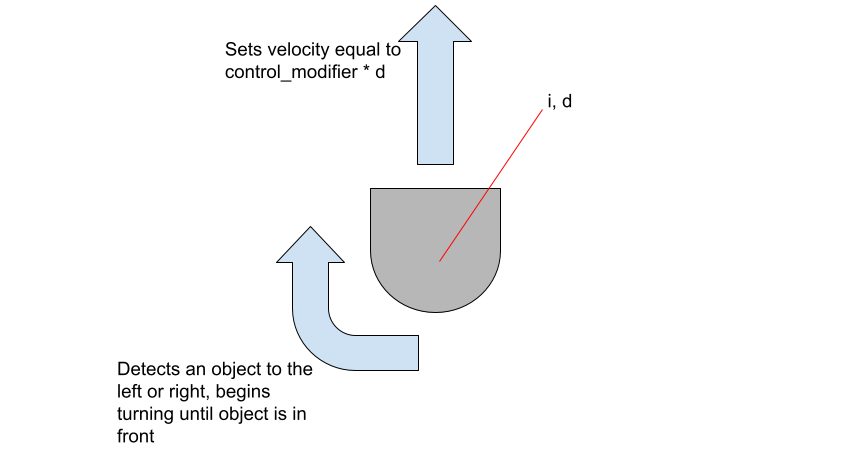
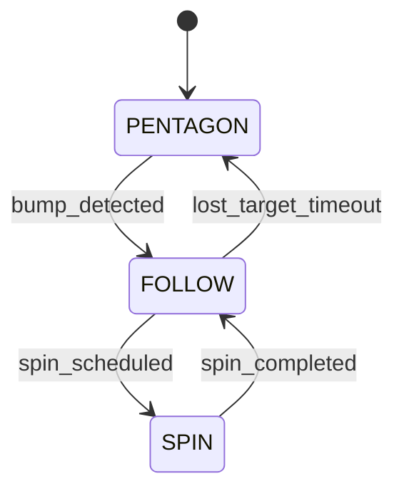
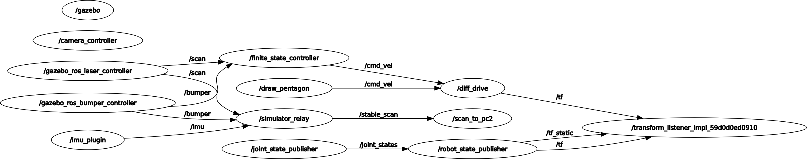

# RoboBehaviors-and-Finite-State-Machines-Project

**ENGR3590: Computation Introduction to Robotics &nbsp;|&nbsp; Fall 2025**  
**Akshat Jain &nbsp;|&nbsp; Satchel Schiavo &nbsp;|&nbsp; Owen Himsworth**

---

## Overview

Our goal was to design and implement a ROS 2 (Humble) robotics Finite State
Machine (FSM) for the Neato robot. We combined three behaviors: driving a
pentagon, spinning 360°, and following people—into this FSM. The FSM supervises
these behaviors, switching between them based on sensor input and timed events.
The project demonstrates successful integration of time-based and reactive
control strategies, with all code running on both simulated and physical Neato
robots.

## Project Prompt

Your goal in this project will be to program the Neato to execute a number of
behaviors (e.g., teleop, driving a trajectory of a pre-defined shape,
wall-following, people-following, and obstacle avoidance) within a finite-state
machine.

## Behaviors

### 360

- **Problem:** The 360 spin is the simplest of all the behaviors in this
  project, only requiring an angular velocity change. We set a rotational speed
  and track how many full rotations the Neato has gone through, before reporting
  the total amount of spins.

- **Approach:** We provided a basic angular velocity through:

```python
angular_vel_rps: float = 0.5, clockwise: bool = False):
        """
        Args:
            angular_vel_rps: Magnitude of angular speed.
            clockwise: If True, spins clockwise (negative z); else CCW.
```

and calculated the total time t that the Neato would spin in:

```Python
"""Publish a constant angular velocity for the required duration, once."""
        # Some setups drop the first message; send a zero first.
        self.drive(0.0, 0.0)
        sleep(1.0)


        total_angle_rad = 2.0 * math.pi
        duration_s = total_angle_rad / abs(self.angular_vel)
```

We then have the Neato constantly spin a full rotation at angular_vel, before
reporting it’s completed a full loop and restarting.

### Drive Pentagram

- **Problem:** Building on our first behavior of a purely rotational movement,
  the next step was to create a static path that incorporated both rotational
  and linear travel. We settled on a pentagon shape because it seemed like a
  non-trivial improvement over the default square trajectory. The main
  motivation for a static path was to have a basic movement pattern and allowed
  us to experiment with angle velocities for turning and linear velocities for
  moving distances.
- **Approach:** At a high level, our pentagon script has the NEATO move forward
  for a set distance at a set linear velocity, rotate 72 degrees at a set
  rotational speed, and then repeat an additional four times. We initially
  struggled to effectively control the NEATOs without a relative position, until
  we decided to reference the NEATOs speed and total time in order to derive the
  travel distance. This also allowed us to create a different sized pentagon by
  changing the edge_length_m while keeping forward_vel and angular_vel constant.
  n\

      We first define edge_length_m, which is the length of one side of the pentagon, and external_turn_rad, which is 72 degrees in radians - ⅕ of a complete 360 degree circle. We then used for side in range(5) to have the Neatos loop a total of five times before we drive forward for a time t determined by:
      ```Python
      t = abs(distance_m) / self.forward_vel if self.forward_vel > 0 else 0.0
      ```
      Then moving for time t before turning left by a time t fixed by:
      ```Python
      t = abs(angle_rad) / self.angular_vel if self.angular_vel > 0 else 0.0
      ```
      Which again followed by time t.

- **Diagram/GIF:**

    

### People Follower

- **Problem:** Both our pentagon and 360 spin behaviors were operated
  independently of the environment our Neato was in, and as such were limited in
  their scope. We built on our angular and linear velocity control to create a
  control loop that allow our Neato to follow a moving box around an
  environment.

- **Approach:** Our solution for a person follower was twofold - first we used a
  LiDAR scan to locate the nearest object, derive coordinates from it, and then
  set up a control loop to move our Neato ito a set distance from the object.
  All Neatos come equipped with a LiDAR scanner, which we used to scan the area
  about our neato and return the closest point’s distance and angle. We then set
  our own Neato’s position and find the distance between the two points, using
  it as a speed modifier. This makes Neato's linear velocity proportional to the
  distance between it and the object, which acts as a basic control loop. n\

      Similarly, we take the difference between the polar coordinate of the object and the origin (aka Neato) and correct the angular velocity as well. This behavior was trickier to tune, as we ended up overshooting our closest object and would cause Neato to latch onto different objects entirely. Through trial and error and we ended up using control values of 0.01 proportional angular gain to help Neato center.

- **Diagram/GIF:**

    

### Finite State Controller

- **Problem:** The final part of this project was to combine all of the
  previously described behaviors into one controller, called a Finite State
  Machine. The FSM stitches together multiple behaviors by instructing Neato to
  switch between them when a sensor is triggered or some time has passed. Neato
  begins repeating it’s pentagon_follower behavior until it detects the bump
  sensor has been pressed, at which point it transitions to person_following.
  From here, Neato continuously checks if a person is still in range, while one
  is it will wait a certain time before switching to spin mode. After Spin
  records completing one full rotation, it will revert back to the person
  following. If at any point during a person following Neato loses it’s target
  long enough to trigger lose_target_timeout, it will revert back to it’s
  pentagon following behavior, where it will stay until it detects a person
  again.

- **Approach:** We created the functions bump_detected and spin_scheduled
  functions to help control the finite state. Bump_detected simply subscribes to
  the physical sensors on the Neato and reports to FSM. Spin_scheduled is a
  timer that constructs \

      While in FOLLOW, a background thread checks every 0.1s.
      If enough time has passed (spin_interval_s), the FSM: \
      Stops FOLLOW. \
      Runs spin_360. \
      Resumes FOLLOW.

#### State Diagram



#### QRT_Graph



#### Operation on Physcial Neato

[▶️ Watch demo on YouTube](https://www.youtube.com/watch?v=IAnVcPswp0I)

#### Operation in Gazebo

[▶️ Watch demo on YouTube](https://youtu.be/Z0-pUuza7xg)

## Challenges

- Setting up the ROS environment was a challenge; once we got the Docker
  container working, it was super helpful, as every time we would start with a
  clean new setup.
- There is a different topic name for the bump sensor in Gazebo and the physical
  Neato, and the output of both of them is also different. Using the 'ros2 echo'
  command, we were able to debug this issue.

## Takeaways

- **Owen:** Testing new code blocks as they are added would significantly reduce
  headaches compared to testing code once it is all written. This follows the
  same practice of writing unit tests alongside writing new functions.
- **Satchel:** Overall system architecture can simplify many functions in the
  Neatos behavior. I struggled with creating functions that communicated between
  different states and bug fixing them. I think our approach of controlling
  position by timing the move forward commands was a creative solution, and
  helped us simplify the amount of testing. Neato testing sucks.

- **Akshat** Designing the FSM before implementing it was a good idea, and we
  implemented it in small steps, which helped, as we were able to test it in
  Gazebo as we were building the FSM. Shifting from the simulation to the
  physical model was a challenging task to solve. In the next project, I will
  try to use Python logger. Overall, I really enjoyed working on the project.

## Code Structure

- Package tree
- Key nodes & responsibilities
- Parameters (`config/params.yaml`)
- Launch files

## Debugging & Tools

- RViz Visualizations
- Rosbag Recording
- Logger

## Next Steps/Improvements

- Playing around with the control parameters more could help make the person
  follower better
- Change the angular direction follower code - right now, we limit the speed to
  be as slow as possible regardless of direction away from the Neato. Including
  some kind of PID control to have Neato more quickly turn to further away
  targets would be a natural next step.
- Integrate Launch functionality to ease in startup procedure.
- We need to write both unit tests and end-to-end tests, maybe some kind of a
  pipeline to test al our code before we run it would be nice.

## Build & Run

```bash
# Build
colcon build --packages-select ros_behaviors_fsm
source install/setup.bash

# Run FSM (with params & RViz)
ros2 run ros_behaviors_fsm finite_state_controller

# View FSM state topic (live state)
ros2 topic echo /fsm/state
```
