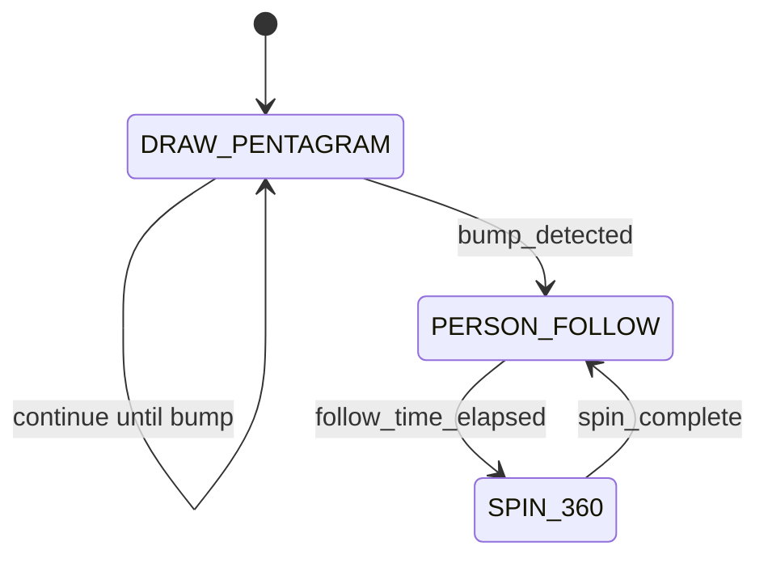

# RoboBehaviors-and-Finite-State-Machines-Project

Your goal in this project will be to program the Neato to execute a number of
behaviors (e.g., teleop, driving a trajectory of a pre-defined shape,
wall-following, people-following, and obstacle avoidance) within a finite-state
machine.

    For each behavior, describe the problem at a high-level. Include any relevant diagrams that help explain your approach.  Discuss your strategy at a high-level and include any design decisions that had to be made to realize a successful implementation.
    For the finite state controller, what was the overall behavior? What were the states? What did the robot do in each state? How did you combine behaviors together and how did you detect when to transition between behaviors?  Consider including a state transition diagram in your writeup.
    How was your code structured? Make sure to include a sufficient detail about the object-oriented structure you used for your project.
    What, if any, challenges did you face along the way?
    What would you do to improve your project if you had more time?
    What are the key takeaways from this assignment for future robotic programming projects? For each takeaway, provide a sentence or two of elaboration.

# Neato Behaviors & Finite-State Machine (CompRobo)

## Overview

One paragraph on your goal, environment (ROS 2 Humble, Neato), and outcomes.

## Behaviors

### Teleop

- **Problem:** drive with keyboard safely.
- **Approach:** non-blocking input → `/cmd_vel`; space stops.
- **Notes:** E-stop; tuned v/w.

### Drive Square

- **Problem:** 1m x 1m square.
- **Approach:** timing-based (v, t_forward, w, t_turn).
- **Diagram/GIF:** (embed)

### 360

- **Problem:**
- **Approach:**
- **Diagram/GIF:**

### Drive Pentagram

- **Problem:**
- **Approach:**
- **Diagram/GIF:**

### People Follower

- **Problem:**
- **Approach:**
- **Diagram/GIF:**

## Code Structure

- Package tree
- Key nodes & responsibilities
- Parameters (`config/params.yaml`)
- Launch files

### State Diagram


## Debugging & Tools

- RViz config
- Rosbag workflow
- Takeaways (3–6 bullets, each w/ one-sentence elaboration)

## Build & Run

```bash
# Build
colcon build --packages-select ros_behaviors_fsm
source install/setup.bash

# Run FSM (with params & RViz)
ros2 launch ros_behaviors_fsm fsm.launch.py use_sim_time:=false

# Run individual behaviors (debug)
ros2 run ros_behaviors_fsm draw_pentagon
ros2 run ros_behaviors_fsm spin_360
ros2 run ros_behaviors_fsm person_follower

# View RViz
rviz2 -d $(ros2 pkg prefix ros_behaviors_fsm)/share/ros_behaviors_fsm/rviz/default.rviz

